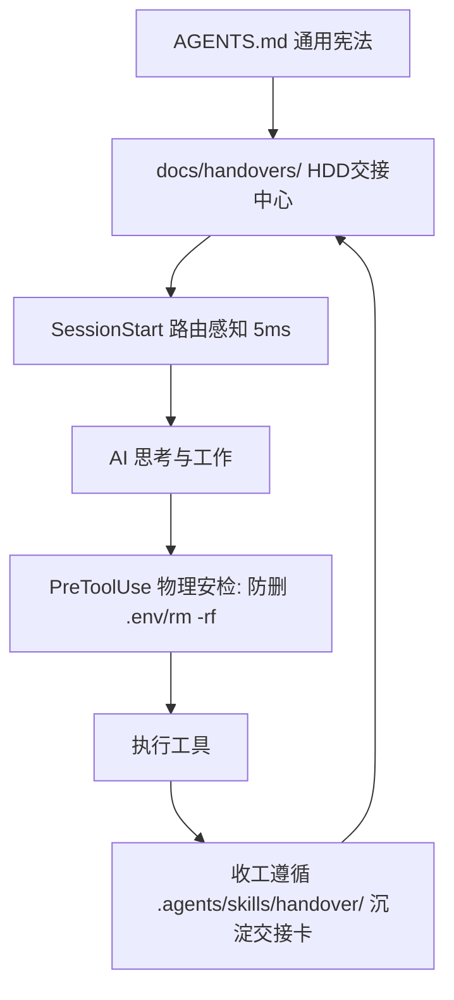

<div align="center">

# Harness Starter

一套通用、轻量、高可控的 **AI Agent Harness Engineering** 模板  
让 AI 拥有确定性的安全带（Hooks）、单一真相源宪法（`AGENTS.md`）与工程交接范式（HDD）

<p>
  
  
  
</p>

> **现代 Agent 公式**：$\text{Agent} = \text{LLM (算力大脑)} + \text{Harness (控制底盘)}$  
> 支持 **OpenAI Codex、Claude Code、Pi Coding Agent、DeepSeek dsh、ZCode** 等主流 Agent 运行环境。

<br>

https://github.com/k1ein-chen/Harness-Starter

[小红书](https://www.xiaohongshu.com/user/profile/5c63da27000000001202556a)

</div>

---

## 📜 核心特性

- **📜 单一真相源（`AGENTS.md`）**：沉淀 Karpathy 行为准则、6 级奥卡姆梯子（YAGNI → 最少代码）、外科手术式修改（Surgical Changes）与硬性目标定义规范。所有 Agent 打开项目即刻遵守。
- **📋 HDD 工程交接范式（Handoff-Driven Development）**：内置 `handover` 技能，阶段性攻坚或下班收工时一键归档高保真文档（ADR / SOP / Handover），自动生成倒序索引表与【🗺️ 路由式摘要】。
- **🛡️ 极致轻量的物理安全带（Hooks）**：
  - `PreToolUse`：物理级硬拦截，禁止 AI 擅自修改 `.env` 或执行 `rm -rf` 等破坏性命令。
  - `SessionStart`：新会话 5ms 极速冷启动，自动提取最新交接卡路由导引（具备空仓优雅降级，100% 保护 Prompt 缓存）。
- **🔍 8 维确定性健康巡检（`gc-scan.mjs`）**：无模型幻觉的纯静态扫描器，检查规则完整性、Git 状态、调试残留、TODO 密度、LSP 与类型健康。
- **📦 智能无痛升级（`upgrade.mjs`）**：版本跟踪机制（`.harness/version.json`），支持 `--dry-run`，自动区分“用户自定义”与“模板原生”文件。

---

## 整体架构



| 组件 | 载体 | 职责 |
|---|---|---|
| **通用宪法** | `AGENTS.md` | 规定思考准则、6 级梯子、Surgical 约束与 HDD 规范 |
| **交接中心** | `docs/handovers/` | 沉淀 ADR 架构决策、SOP 运维手册与 Handover 交接卡 |
| **物理安检** | `.agents/hooks/pre-tool-check.mjs` | 毫秒级阻断高危操作与保护敏感配置文件 |
| **冷启动导引** | `.agents/hooks/session-context.mjs` | 读取最新交接断点并注入新会话（空仓优雅降级） |
| **确定性巡检** | `scripts/gc-scan.mjs` | 独立运行 / 定时 Loop 的 8 维代码与环境体检 |

---

## 快速开始

### 方式一：npm 一键安装（推荐）

```bash
npx harness-starter              # 安装到当前目录
npx harness-starter /path/to/proj  # 安装到指定目录
npx harness-starter --force      # 覆盖已有文件
```

### 方式二：手动复制

```bash
# 1. 克隆模板
git clone https://github.com/k1ein-chen/Harness-Starter.git /tmp/harness

# 2. 复制到目标项目
cp -r /tmp/harness/.agents/ /tmp/harness/.claude/ /tmp/harness/scripts/ /tmp/harness/docs/ /tmp/harness/AGENTS.md /tmp/harness/CLAUDE.md /tmp/harness/.lsp.json /path/to/your-project/

# 3. 验证环境
cd /path/to/your-project && node scripts/check.mjs
```

---

## 项目结构

```
your-project/
├── AGENTS.md                  # 🌟 通用行为宪法 (Codex/Pi/dsh/Claude 通用)
├── CLAUDE.md                  # 🌟 Claude 门面：声明技术栈 + 指向 AGENTS.md
├── .lsp.json                  # LSP 语言服务配置
├── .gitignore                  # 忽略规则
│
├── docs/                      # 📚 文档与交付中心
│   ├── handovers/             #   - HDD 任务交接中心 (README.md 倒序索引)
│   └── guides/                #   - 核心工程指南 (成熟度模型 / 目标定义 / Loop 模板)
│
├── scripts/                   # 🌟 通用确定性工具箱 (纯 Node 原生)
│   ├── check.mjs              # 安装与环境健康体检
│   ├── gc-scan.mjs            # 8 维确定性巡检
│   ├── init.mjs               # 一键安装器
│   └── upgrade.mjs            # 智能无痛升级
│
├── .agents/                   # 🌟 统一核心资产中心
│   ├── hooks/                 # 物理级拦截与上下文脚本
│   │   ├── pre-tool-check.mjs # 安全拦截
│   │   ├── session-context.mjs# HDD 冷启动感知
│   │   ├── post-tool-check.mjs# (L3 可选) 自动格式化
│   │   ├── pre-compact.mjs    # (L3 可选) 记忆压缩快照
│   │   └── lib/harness-context.mjs # 共享数据层
│   └── skills/
│       └── handover/          # HDD 通用交接技能规范 (ADR / SOP / Handover 模板)
│
└── .claude/                   # 🔌 Claude Code 一等公民适配层
    ├── settings.json          # Hook 路由注册表
    └── skills/                # Claude 原生 Slash 命令 (harness-init / harness-mode 等)
```

---

## 常用工作流

### 1. 任务交接与每日收工（HDD 范式）
在任何 Agent 中直接对 AI 说：
```text
帮我交接一下当前任务（遵循 .agents/skills/handover/ 规范）
```
AI 将会自动核实物理变更（`git status -s`），生成带【🗺️ 路由式摘要】的高保真交接文档至 `docs/handovers/`，并更新索引。

### 2. 系统 GC 自治巡检
```bash
# 本地手动扫描
node scripts/gc-scan.mjs

# 格式化 JSON 输出（供 CI 或其他工具消费）
node scripts/gc-scan.mjs --json

# CI 门禁检查（有 critical 告警则非零退出）
node scripts/gc-scan.mjs --ci
```

### 3. 模板升级检查
```bash
# 预览更新（不修改任何文件）
node scripts/upgrade.mjs --dry-run

# 执行智能合并升级
node scripts/upgrade.mjs
```

---

<div align="center">

[English](README.en.md) · MIT License

</div>
