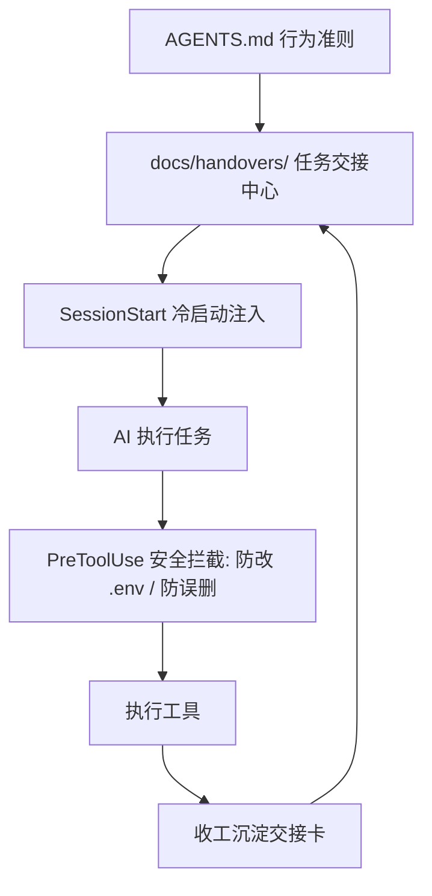

<div align="center">

# Harness Starter

轻量、可控的 **AI Agent Harness 工程化脚手架**  
为 AI 编程助手提供操作安全护栏（Hooks）、统一行为准则（`AGENTS.md`）与任务交接流（HDD）

<p>
  
  
  
</p>

> **Agent 架构模型**：`Agent = LLM (模型计算) + Harness (控制底盘)`  
> 兼容 **OpenAI Codex、Claude Code、Pi Coding Agent、DeepSeek dsh、ZCode** 等主流 Agent 运行环境。

<br>

https://github.com/k1ein-chen/Harness-Starter

[小红书](https://www.xiaohongshu.com/user/profile/5c63da27000000001202556a)

</div>

---

## 核心特性

- **统一行为规范（`AGENTS.md`）**：沉淀 Karpathy 编码准则、代码最小化原则（YAGNI）、局部精准修改（Surgical Changes）与硬性目标定义规范，作为全项目 Agent 的统一基准。
- **任务交接工作流（HDD - Handoff-Driven Development）**：内置 `handover` 技能规范，阶段任务或收工时一键归档高保真文档（ADR / SOP / Handover），自动生成倒序索引表与路由导引。
- **操作安全护栏（Hooks）**：
  - `PreToolUse`：物理级硬拦截，禁止 AI 擅自修改 `.env` 等敏感文件，拦截 `rm -rf` 等破坏性命令。
  - `SessionStart`：新会话 5ms 极速冷启动，自动提取最新交接断点（具备空仓平滑降级，不破坏 Prompt 缓存）。
- **静态健康巡检（`gc-scan.mjs`）**：确定性的静态代码与环境扫描器，检查规则完整性、Git 状态、调试残留、TODO 密度与 LSP 配置。
- **平滑升级机制（`upgrade.mjs`）**：基于版本跟踪（`.harness/version.json`）与 `--dry-run` 预览，智能区分用户自定义内容与模板默认配置。

---

## 架构流程



| 模块 | 载体 | 核心职责 |
|---|---|---|
| **行为准则** | `AGENTS.md` | 明确思考准则、代码最小化约束、修改范围与交接规范 |
| **交接中心** | `docs/handovers/` | 沉淀 ADR 架构决策、SOP 运维手册与 Handover 研发交接卡 |
| **安全护栏** | `.agents/hooks/pre-tool-check.mjs` | 毫秒级阻断高危操作，保护关键配置文件 |
| **冷启动注入** | `.agents/hooks/session-context.mjs` | 读取最新交接断点并注入新会话（空仓平滑降级） |
| **健康体检** | `scripts/gc-scan.mjs` | 独立运行的静态规则、Git 状态与代码质量巡检 |

---

## 快速开始

### 方式一：npm 一键安装（推荐）

```bash
npx harness-starter              # 安装到当前目录
npx harness-starter /path/to/proj  # 安装到指定目录
npx harness-starter --force      # 覆盖已有文件
```

### 方式二：手动复制

```bash
# 1. 克隆模板
git clone https://github.com/k1ein-chen/Harness-Starter.git /tmp/harness

# 2. 复制到目标项目
cp -r /tmp/harness/.agents/ /tmp/harness/.claude/ /tmp/harness/scripts/ /tmp/harness/docs/ /tmp/harness/AGENTS.md /tmp/harness/CLAUDE.md /tmp/harness/.lsp.json /path/to/your-project/

# 3. 验证环境
cd /path/to/your-project && node scripts/check.mjs
```

---

## 目录结构

```text
your-project/
├── AGENTS.md                  # 统一行为准则 (Codex / Claude Code / Pi / dsh 通用)
├── CLAUDE.md                  # Claude 门面：声明技术栈 + 引入 AGENTS.md
├── .lsp.json                  # LSP 语言服务配置
├── .gitignore                  # Git 忽略配置
│
├── docs/                      # 文档与交付中心
│   ├── handovers/             #   - 任务交接记录 (README.md 倒序索引)
│   └── guides/                #   - 工程指南 (成熟度模型 / 目标定义 / 循环模板)
│
├── scripts/                   # 自动化脚本 (纯 Node.js 标准库)
│   ├── check.mjs              # 环境与配置检查
│   ├── gc-scan.mjs            # 静态健康巡检
│   ├── init.mjs               # 项目初始化脚本
│   └── upgrade.mjs            # 模板版本升级
│
├── .agents/                   # 通用核心资产
│   ├── hooks/                 # 安全拦截与冷启动注入脚本
│   │   ├── pre-tool-check.mjs # 敏感文件与危险命令拦截
│   │   ├── session-context.mjs# 会话冷启动断点注入
│   │   ├── post-tool-check.mjs# (可选) 代码自动格式化
│   │   ├── pre-compact.mjs    # (可选) 会话压缩前状态快照
│   │   └── lib/harness-context.mjs # 共享工具函数
│   └── skills/
│       └── handover/          # 交接技能规范 (ADR / SOP / Handover 模板)
│
└── .claude/                   # Claude Code 适配层
    ├── settings.json          # Hook 注册配置
    └── skills/                # Claude 原生 Slash 命令 (harness-init / harness-mode 等)
```

---

## 常用工作流

### 1. 任务交接与收工归档
在任何 Agent 中直接说明：
```text
帮我交接一下当前任务（参考 .agents/skills/handover/ 规范）
```
AI 会自动读取实际变更（`git status -s`），生成包含【路由式摘要】的高保真交接文档至 `docs/handovers/`，并自动更新索引。

### 2. 项目健康巡检
```bash
# 本地控制台检查
node scripts/gc-scan.mjs

# 输出结构化 JSON
node scripts/gc-scan.mjs --json

# CI 门禁检查（存在 critical 告警则非零退出）
node scripts/gc-scan.mjs --ci
```

### 3. 模板升级
```bash
# 预览更新内容（不修改文件）
node scripts/upgrade.mjs --dry-run

# 执行智能升级
node scripts/upgrade.mjs
```

---

<div align="center">

[English](README.en.md) · MIT License

</div>
